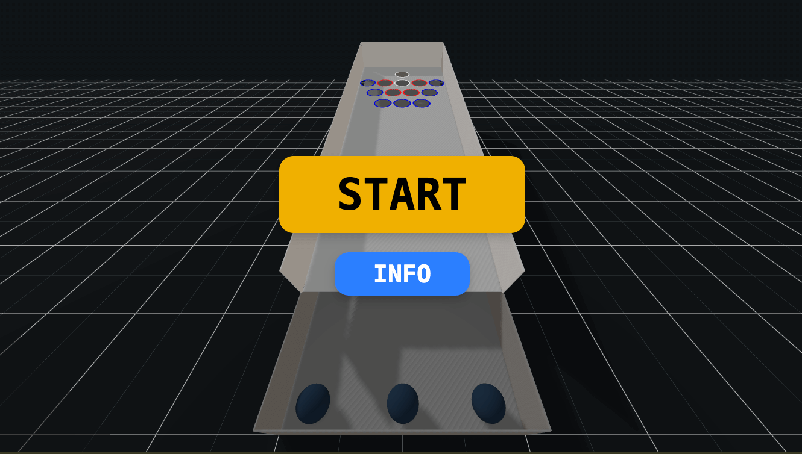

# Carnival 3D Game Demo

This project is a React application bootstrapped with Vite, styled using Tailwind CSS, and includes ShadCN for UI components. Additionally, it leverages React-Three-Fiber, a powerful library for building 3D graphics in React, to create immersive 3D experiences.

## Technologies Used

- **React**: A JavaScript library for building user interfaces, particularly single-page applications where you can create reusable UI components.
- **Vite**: A build tool that provides a faster and leaner development experience for modern web projects. It offers fast server start, instant hot module replacement, and optimized builds.
- **Tailwind CSS**: A utility-first CSS framework for creating custom designs without having to leave your HTML. It provides low-level utility classes to build complex designs.
- **ShadCN**: A component library that provides reusable UI components to speed up development.
- **React-Three-Fiber**: A React renderer for Three.js, allowing you to build 3D graphics using React components. It simplifies the process of creating complex 3D scenes and animations by leveraging the declarative nature of React.

## Development

This project was written 99% (prob. less, cursor was struggling with deployment and asset bundling) using Cursor and Claude 3.5, showcasing the capabilities of these tools in modern web development.
